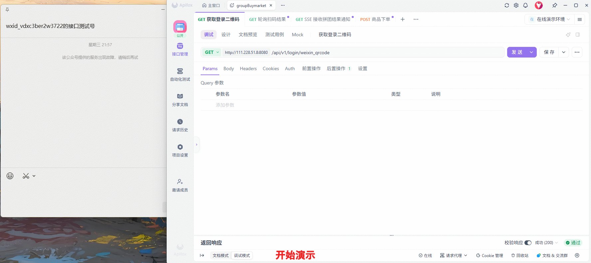

# 🛒 Group Buy Platform (拼团购物交易平台)

>一个基于 **Spring Boot**，参考互联网电商经典拼团场景，探索并实现的高并发**全链路后端交易系统**。

#### 🔗 快速链接 (Quick Links)

- 在线接口文档：[点击查看 API Documentation (APIFox)](group-buy-plataform.apifox.cn)  
- API 文档: [项目详细文档 ](docs/)
- 支付宝沙箱支付账户： `tpgvta9856@sandbox.com`
- 支付宝沙箱登录密码&支付密码：`111111`

## 一. 项目背景 (Project Background)

本项目参考互联网电商核心业务的__拼团营销__。拼团作为电商中典型的高并发、长链路业务，涵盖了下单、锁库存、支付、结算、通知等一系列复杂流程。

在开发过程中，尝试还原真实生产环境中的挑战，将项目作为一次**全链路工程化实践**的载体，重点探索了以下问题的解决方案：

* **复杂业务链路治理**：面对拼团业务中“下单->锁单->风控->支付->结算”的冗长流程，传统的线性代码往往难以维护。我尝试引入并集成了 **DAGFlow**（自研的任务编排组件），将复杂的业务逻辑抽象为可视化的图结构，以提升代码的可读性与扩展性。
* **工程化与自动化交付**：为了体验现代软件开发的交付流程，我引入了 **DevOps** 理念。利用 **GitHub Actions** 搭建了自动化 CI/CD 流水线，实现了代码提交后的自动构建与云端部署，确保项目始终处于可交付状态。
* **系统的动态治理**：在模拟真实运营场景时，我意识到系统需要具备“运行时配置”的能力。因此实现了一个轻量级的 **DCC (Dynamic Config Center)**，用于在不重启服务的情况下动态调整系统参数（如降级开关、模拟测试白名单等），以此提升系统的灵活性。

## 🎯 二. 项目目标 (Project Goals)

本项目的核心目标是构建一个**麻雀虽小，五脏俱全**的交易系统 MVP（最小可行性产品），主要致力于：

1. **业务落地**：完整实现从“微信扫码登录”到“拼团成功通知”的交易闭环。
2. **模块化设计**：采用了清晰的分层架构（Infrastructure / Domain / Trigger），将交易、订单、活动、用户等模块解耦，避免业务逻辑过度耦合，便于维护与扩展。
3. **技术验证**：验证 **DAGFlow** 编排引擎在复杂业务场景下的适用性，以及 **SSE (Server-Sent Events)** 在服务端实时通知场景下的应用。
4. **工程闭环**：打通从开发、测试到部署的完整自动化链路，模拟企业级的开发协作流程。

## 📈 三. 项目进展 (Progress & MVP Status)

当前版本定位为 **MVP v1.0**，核心业务链路已完全跑通：

- [x] **基础设施**：MySQL, Redis, Docker 环境搭建完成。
- [x] **DevOps**：GitHub Actions 自动化部署流水线已上线。
- [x] **用户认证**：微信公众号扫码登录 + JWT 双 Token (7天无感认证) + SSE 登录通知。
- [x] **交易核心**：基于 DAGFlow 的下单锁单链路、支付回调、异步结算链路。
- [x] **动态配置**：DCC 配置中心上线，支持“开启特权用户”、“token有效期配置”、“切量、降级”，“黑名单”等功能。
- [x] **消息通知**：拼团成功的 SSE 实时推送与微信登录模板消息触达。

## 📺 四. 功能演示与沉浸式体验 (Demo & Hands-on)

为了让您能够最直观地感受系统功能，我提供了**视频演示**和**在线体验模式**两种方式。

### 4.1 功能演示 (Video Demo)

下图完整记录了用户在真实网络环境下，与部署在云端的 MVP 系统进行交互的全过程。

(注：涵盖：微信扫码登录 -> 商品浏览 -> 下单锁定 -> 模拟支付 -> 结算成团 -> 接收 SSE 实时成团通知)

### 4.2 📚 沉浸式体验模式 (Demo Mode)

为了解决非开发人员（或无法使用微信测试号的用户）无法体验系统核心功能的问题，本项目设计了一套基于 **DCC（动态配置中心）** 的体验模式。

该模式允许管理员通过“后门密钥”动态开启体验开关，并下发体验令牌。体验者**无需扫码**，即可通过特定的 Token 模拟任意用户身份，完成下单、拼团等全链路测试。

#### 🧪 详细实验流程

请按照以下步骤使用 Postman / APIFox 或在线文档进行体验：

**1. 开启模拟模式 (管理员权限)**

- 使用 **DCC 管理密钥** (`dccAdminSecret`) 访问 DCC 更新接口。
- 将 `demoTokenSwitch` 配置项的值设为 `1`。
- *接口示例*: `GET /api/v1/gbm/dcc/update_config?key=demoTokenSwitch&value=1`

**2. 获取体验凭证**

- 在 DCC 配置列表中查询以下两项关键参数：
- `demoTokenSecret`: 体验专用 Token（例如：`Bearer experience-token-vip-888`）。
- `demoUserId`: 当前模拟的用户 ID。

**3. 业务功能体验**

- 复制 `demoTokenSecret` 的值。
- 在访问任意业务接口（如商品列表、下单、拼团）时，将该值填入请求头的 `Authorization` 字段。
- **效果**：网关将自动放行，并将您识别为配置中的 `demoUserId` 用户。

**4. 高级玩法：多用户身份切换**

- 在测试“拼团”等需要多人交互的场景时，无需准备多个微信号。
- **操作**：保持体验 Token 不变，通过 DCC 接口动态修改 `demoUserId` 的值（改为另一个随机 ID）。
- **结果**：再次发起请求时，系统即认为您是另一名新用户。您可以通过此方式**一个人完成“开团-换身份-参团”的完整流程**。

#### ⚙️ 动态配置项说明 (DCC)

本功能完全基于 DCC 实现热更新，**无需重启服务**即可实时生效。

| **配置项 Key**    | **默认值**                        | **说明**                                                     |
| ----------------- | --------------------------------- | ------------------------------------------------------------ |
| `demoTokenSwitch` | `0`                               | **总开关**。`0`-关闭，`1`-开启。开启后允许使用体验 Token 访问。 |
| `demoTokenSecret` | `Bearer experience-token-vip-888` | **体验令牌**。请求 Header 中 `Authorization` 携带的值。      |
| `demoUserId`      | `7736...96`                       | **虚拟身份**。系统将把使用体验令牌的请求视为该 UserID 的操作。 |
| `dccAdminSecret`  | `Bearer admin-key-2024`           | **管理钥匙**。仅用于访问 DCC 接口修改上述配置，拥有最高权限。 |

💡 **安全提示**：线上环境建议默认关闭此开关。演示结束后，请立即将 `demoTokenSwitch` 设回 `0` 以确保系统安全。

## 五. 技术栈 (Tech Stack)

| 领域 | 技术/组件 | 说明 |
| :--- | :--- | :--- |
| **核心框架** | Spring Boot 2.7.x | 基础脚手架 |
| **流程编排** | **DAGFlow (Self-Research)** | **自研组件**，用于下单、结算等长链路编排 |
| **数据存储** | MySQL + MyBatis | 核心业务数据持久化 |
| **缓存/中间件**| Redis (Redisson) | 分布式锁、DCC配置存储、缓存加速 |
| **异步/通知** | SSE (Server-Sent Events) | 实现服务端主动推送（扫码登录、成团通知），轻量级替代 WebSocket |
| **身份认证** | JWT + 微信 OAuth2 | 实现无感刷新 Token (7天免登录) |
| **DevOps** | Docker + Docker Compose | 容器化部署 |
| **CI/CD** | **GitHub Actions** | 自动化构建与部署流水线 |

